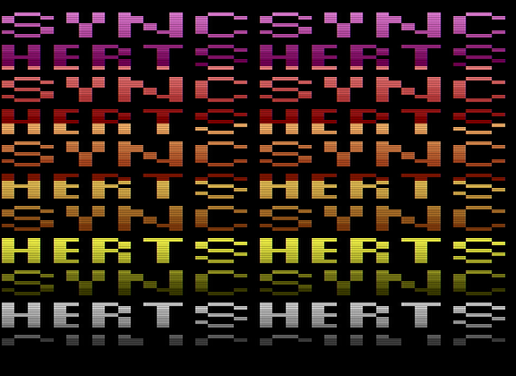

# syncherts demo

This is a simple demo that draws upon the [2600 101 tutorial by Kirk Israel](http://www.atariage.com/2600/programming/2600_101/index.html).

The code has a lot of comments about what each section is doing, and all we're going to
do is make the playfield look like this:

## building

You'll need to have built dasm or installed a binary to turn the syncherts.asm
assembler code into a binary file you can play with.

If you have make, I've included a very simple Makefile, so you can simply run

    make

You'll wind up with a syncherts.bin you can open in the stella emulator.

If you don't have make, don't worry, you just need a command line like this

    dasm syncherts.asm -f3 -v5 -osyncherts.bin

